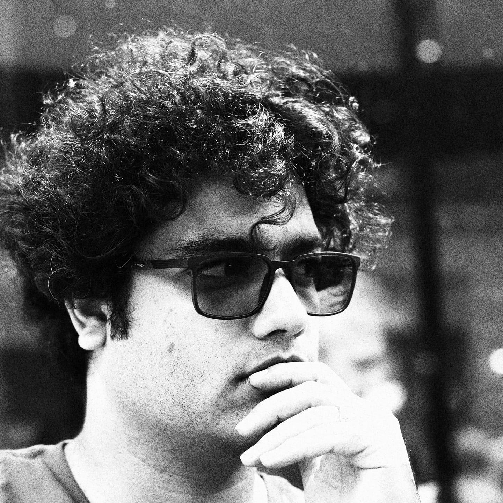

# Mahdi Eskandari, PhD Candidate @ University of Kent

## About Me

Hello, world!

First and foremost, I love writing code. My first experience with coding was a simple pathfinding program in C. Despite its bugs, it was an unforgettable learning experience. Since then, I've been passionate about using software to solve problems and improve lives.

### My Journey

Analog modulation sparked my interest in communication. Implementing Turbo codes in MATLAB was my first bug-free project in wireless communication. This experience showed me the power of programming to tackle real-world challenges.

### Professional Experience

As a Python developer in the stock market industry, I honed my skills in machine learning. I developed RL agents for discrete and continuous action spaces, as well as multi-agent scenarios.

### Current Focus

I'm currently pursuing a Ph.D. at the University of Kent, researching RL algorithms in 5G and beyond. My work aims to innovate wireless communications and explore new applications of machine learning.

### Skills

- **Programming Languages**: Python, familiar with Julia, MATLAB
- **Reinforcement Learning**: DQN, Actor-Critic, Multi-agent RL
- **Optimization**: Convex optimization, Bayesian optimization
